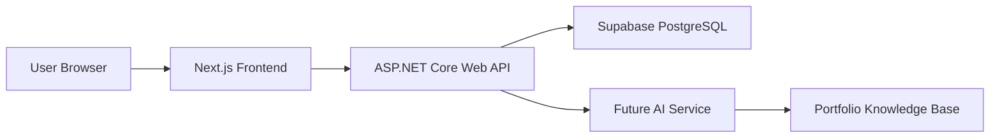

# Architectural Plan

## Goal

Build a portfolio platform that demonstrates full stack development, React/Next.js fluency, ASP.NET Core API design, database modeling, authentication, DevOps readiness, and future AI engineering direction.

## High-Level Flow

## Frontend

- Public pages: Home, About, Experience, Skills, Projects, AI Journey, Blog, Contact
- Admin pages: Login, Dashboard, Manage Projects, Manage Skills, Manage Experience, Manage Blog Posts, Profile Settings
- Style direction: dark editorial interface inspired by Solais, with strong typography, thin grid lines, compact dashboards, and motion-enhanced sections.

## Backend

- `Portfolio.API`: controllers, authentication, middleware
- `Portfolio.Application`: services, DTOs, business rules
- `Portfolio.Infrastructure`: EF Core and persistence adapters
- `Portfolio.Domain`: entities and interfaces

## Future AI Assistant

The future "Ask Adithya AI" module should start with a deterministic portfolio knowledge base and later evolve toward embeddings, vector search, RAG, and agentic workflows.

